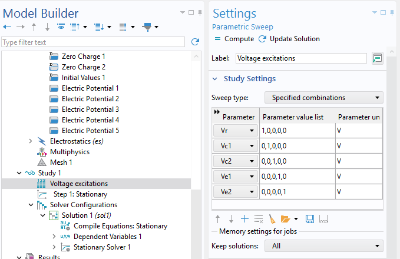
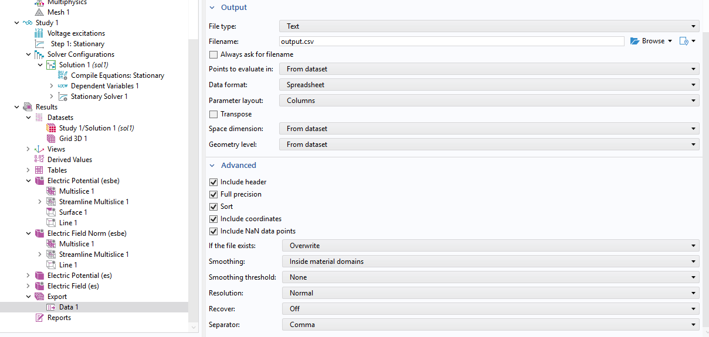
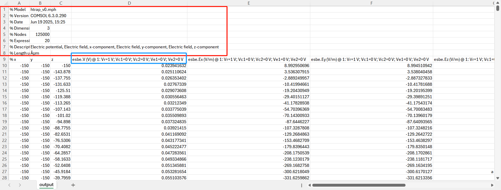

# Anharmonicity Analysis

## Overview 
This package is developed from a subset of the [PaulTrapAnalysis](https://github.com/HaeffnerLab/PaulTrapAnalysis.git) package, with a focus on analyzing the anharmonicities in trapping potentials. The recommended workflow is to perform DC/BEM simulations in COMSOL, then export the data into a .csv, and load the data using this package and perform the analysis.

## Installation 
```bash
git clone https://github.com/HaeffnerLab/anharmonicity-analysis.git  
cd <path>/anharmonicity-analysis  # cd into the cloned directory
pip install -e .  # install with edit capabilities
```

## COMSOL simulations

### Simulation setup 
Refer to [bem-comsol](https://github.com/fengxiaot/bem-comsol?tab=readme-ov-file#build-an-model-in-comsol) package authored by Xiaotian Feng, specifically the `Build an model in COMSOL` section.

### Parametric sweep 
If you are simulating multiple electrodes in COMSOL, you can use the parametric sweeping method to apply voltage exciations individually to each electrode. In the following example, 5 electrodes are used, and an `Electric Potential` boundary condition is applied to each electrode *ei* with voltage created as a variable named *Vei*. Then, a parametric sweep is set up as shown in the following figure.

The parameter value is created using one-hot encodings, indicating separate 1V excitations for each electrode. The 1V value is chosen here as a convention, and this is needed for the package to identify the field created by each electrode. 

### Exporting results
The result can be directly exported into a .csv file, with `Parameter layout` in the *Columns* format, as shown in the figure below.

An example output file can be found in `example/output.csv`. Note that in this output file, the first 8 rows should be skipped if `pd.read_csv` is used to load the file. In addition, the parameteric sweep configuration is embedded in the header of the spreadsheet. Here, `Vr=1`, for example, is used as a flag in the code when loading data to correlate that data column to the electrode named `r`, and this is why a variable and electrode naming convention should be used for convenience.


## Data analysis 
This package mainly contains four files located in `./anharm_analysis`. The main structure follows:
* `Electrode.py`: Contains the `Electrode` object that loads and stores the data for each individual electrode. 
* `Trap.py`: Contains the `Trap` object that collects several electrodes and perform all higher-level analysis including spherical harmonics expansion and frequency shift estimation.
* `Grid.py`: Contains different data structures to store the spatial coordinates of the simulation and fitting data. 
* `utils.py`: Contains all utility functions used in the code. Several functions can be useful separately outside of this code framework for specific analysis as well.

An example of using the package can be found in `./example/example.ipynb`.
